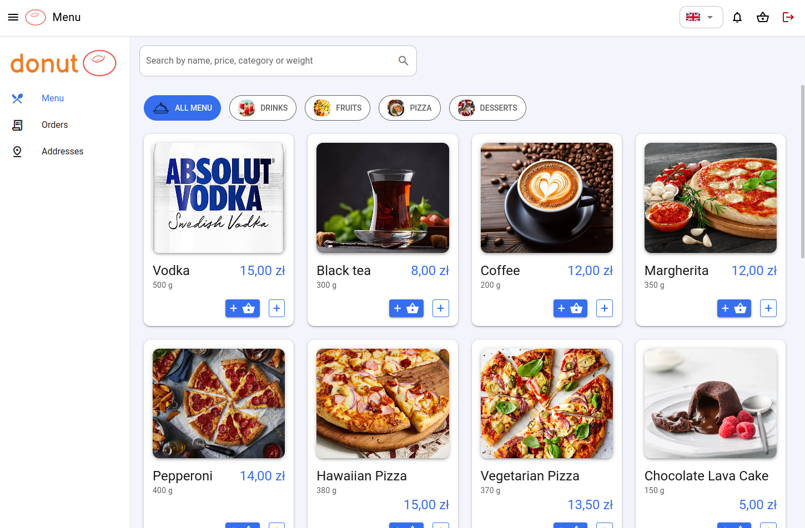

# Donut, a POS system

- **Fully-realtime** cloud-based **POS** for restaurants
- Supports **3 order types**: dine-in, takeout, delivery
- Has **5 user roles**: admin, client, waiter, cook, courier
- Includes **5 applications**: kitchen display, courier app, client app, admin panel, waiter app
- Sends real-time in-app and email **notifications**
- Integrates with **Stripe** to support Credit Card and Blik payments.

